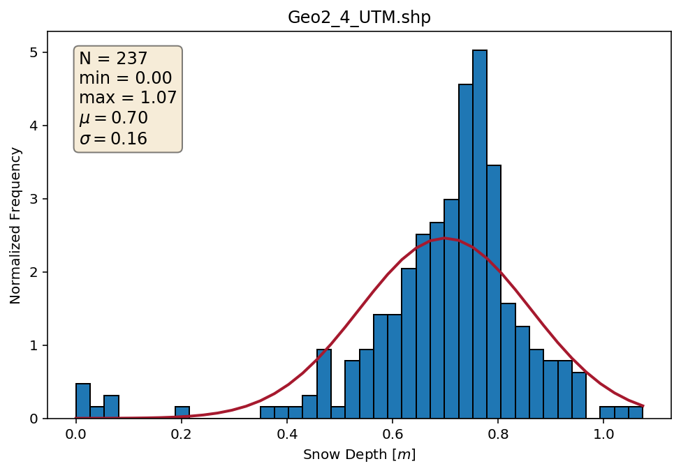
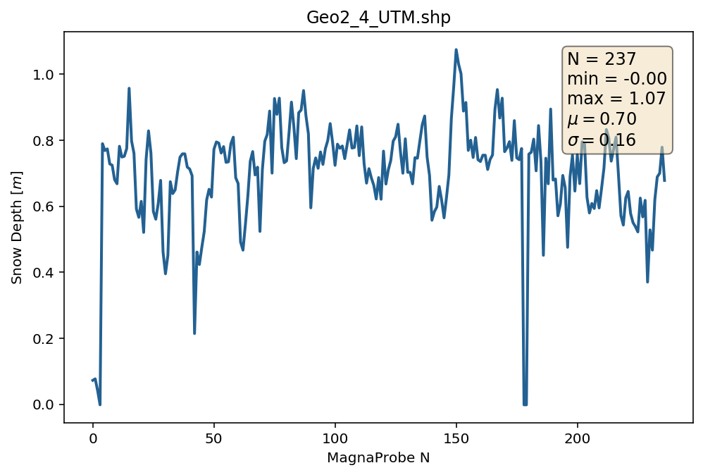
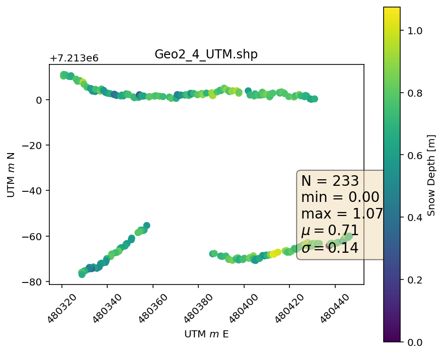

# magnaprobe-tools
## Tools to better wrangle / analyse / plot MagnaProbe snow depth data.

The MagnaProbe is an automated snow depth measuring device that records a geolocated snow depth at the click of a button. See [Sturm & Holmgren (2018)](https://doi.org/10.1029/2018WR023559) for instrument details.

This repository is a set of 'first cut' tools designed for rapidly checking the quality and nature of your MagnaProbe data. 

**Wrangle messy data that looks like this:**

| TOA5 | 29037 | CR800 | 29037 | CR800.Std.27 | CPU:Geophys2_GPSProbe.CR8 | 60528 | OperatorView |  |  |  |  |  |  |  |  |  |  |  |  |  |  |
|------------------------|--------|---------|---------|--------------|---------------------------|------------|--------------|-------------|-------------|-----------------|------|-----------|------------|---------------|----------------|-------|------------|-----------|---------|---------|--------------|
| TIMESTAMP | RECORD | Counter | DepthCm | BattVolts | latitude_a | latitude_b | Longitude_a | Longitude_b | fix_quality | nmbr_satellites | HDOP | altitudeB | DepthVolts | LatitudeDDDDD | LongitudeDDDDD | month | dayofmonth | hourofday | minutes | seconds | microseconds |
| TS | RN |  |  |  | degrees | minutes | degrees | minutes | unitless |  |  |  |  |  |  |  |  |  |  |  |  |
|  |  | Smp | Smp | Smp | Smp | Smp | Smp | Smp | Smp | Smp | Smp | Smp | Smp | Smp | Smp | Smp | Smp | Smp | Smp | Smp | Smp |
| 2017-11-14 11:27:00.75 | 5721 | 100001 | 7.283 | 13.75 | 65 | 2.4724 | -147 | -25.0191 | 1 | 5 | 1.7 | 723.9 | 0.48 | 0.04120666 | -0.416985 | 11 | 14 | 11 | 27 | 0 | 750000 |
| 2017-11-14 15:14:14.75 | 5722 | 100002 | 7.732 | 13.78 | 65 | 2.4724 | -147 | -25.0163 | 1 | 5 | 1.7 | 723.1 | 0.51 | 0.04120666 | -0.4169383 | 11 | 14 | 15 | 14 | 14 | 750000 |
| 2017-11-14 15:14:15 | 5723 | 100003 | 4.138 | 13.75 | 65 | 2.4721 | -147 | -25.0147 | 1 | 9 | 0.9 | 729.4 | 0.28 | 0.04120166 | -0.4169117 | 11 | 14 | 15 | 14 | 15 | 0 |

**To a table like this:**

| timestamp | counter | Latitude | Longitude | Snow Depth m | geometry |
|------------------------|---------|-------------|--------------|--------------|---------------------------------------------|
| 2017-11-14 11:27:00.75 | 100001 | 65.04120666 | -147.416985 | 0.07283 | POINT (480366.7874728901 7213111.766199158) |
| 2017-11-14 15:14:14.75 | 100002 | 65.04120666 | -147.4169383 | 0.07732 | POINT (480368.9862584753 7213111.751691903) |
| 2017-11-14 15:14:15 | 100003 | 65.04120166 | -147.4169117 | 0.04138 | POINT (480370.2349955766 7213111.186195726) |

**So you can quickly plot these:**

### Dependencies
* geopandas 0.6.2
* pandas 0.25.3
* matplotlib 3.1.2
* numpy 1.17.3

### Warnings
The tools are intended to be flexible, but are configured largely for a "stock" MagnaProbe configurations. Non-English language users or users with differently programmed hardware will need to tweak field names, calibration patterns, etc. Finally, this is not a 100% process. If you closely, there are still some suspect points in the example data...but one of the reasons to rapidly generate the quick and dirty plots is to look for instrument errors or data that should be discarded!

### Usage Examples

``python magnaprobe.py example_data/Geo2_4_raw.dat 32606 output_data/Geo2_4_UTM.shp output_data/Geo2_4_UTM.csv``

``python plot_magnaprobe.py output_data/Geo2_4_UTM.shp --save_plots true``
